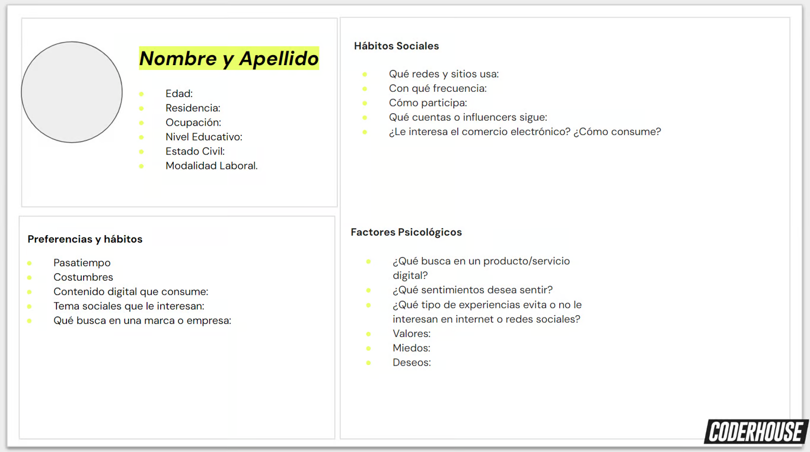

# 🟡 Actividad práctica: Bocetando un arquetipo de cliente

- **Contexto**
    - Coder Airlines es una nueva aerolínea de bandera, y se está posicionando fuertemente en el mercado.

    - Necesita ayuda urgente de un especialista en CM. En primera instancia, necesita contar con un arquetipo de cliente para la empresa. Te invitamos a dejar volar tu imaginación y a jugar un poco.

- **Consigna**
- Imagina y desarrolla el arquetipo de cliente para una aerolínea como Coder Airlines y asígnale una imagen.
- Ten en cuenta las siguientes preguntas para definir el arquetipo de cliente:
    - **Datos demográficos**: 
        - ¿género? 
        - ¿Edad? 
        - ¿Localización? 
        - ¿Nivel educativo? 
        - ¿Nivel de ingresos? 
        - ¿Profesión? 
        - ¿Modalidad laboral?
    - **Preferencias y hábitos**: 
        - ¿pasatiempos? 
        - ¿Pasiones? 
        - ¿Contenido digital que consume? 
        - ¿Qué temas sociales le interesan? 
        - ¿Qué busca en una marca?
    - **Hábitos sociales**: 
        - ¿qué redes y sitios usa? 
        - ¿Con qué frecuencia? 
        - ¿Cómo participa? 
        - ¿Qué influencers sigue?
    - **Factores psicológicos**: 
        - ¿cuáles son sus deseos? 
        - ¿Ambiciones? 
        - ¿Miedos? 
        - ¿Valores? 
        - ¿Qué busca que un producto o servicio le haga sentir? 
        - ¿Qué tipo de experiencias evita?

- **Plantilla de ejemplo**

## ✈️ Arquetipo de cliente: “Valentina, la Exploradora Digital”
- 🧍‍♀️**Datos demográficos**
    - Género: Femenino
    - Edad: 29 años
    - Localización: Colonia del Sacramento, Uruguay
    - Nivel educativo: Universitario completo (Lic. en Comunicación Digital)
    - Nivel de ingresos: Medio-alto
    - Profesión: Community Manager freelance y creadora de contenido
    - Modalidad laboral: Remoto / Nómada digital

- 🎯 **Preferencias y hábitos**
    - Pasatiempos: Viajar, escribir blogs de viaje, probar cafés de especialidad, hacer yoga
    - Pasiones: Explorar nuevas culturas, capturar momentos estéticos para redes
    - Contenido digital que consume: blogs de viaje en YouTube, reels inspiracionales, newsletters de lifestyle y trabajo remoto
    - Temas sociales de interés: Sostenibilidad, diversidad cultural, igualdad de género, derechos digitales
    - ¿Qué busca en una marca? Autenticidad, responsabilidad social y digital, precios justos, estilo visual moderno

- 🌐 **Hábitos sociales**
    - Redes y sitios que usa:
        - Instagram (diariamente, para inspiración y networking)
        - TikTok (varias veces por semana, para entretenimiento)
        - LinkedIn (una vez por semana, para oportunidades laborales)
        - Google Maps y blogs de viaje (al planear itinerarios)
    - Participación:
        - Comenta, guarda y comparte contenido
        - Participa en encuestas y sorteos de marcas
    - Influencers que sigue:
        - @lucastrotamundos (viajero minimalista)
        - @viajeradepapel (tips de nómadas digitales)
        - @greentrotters (turismo sustentable)

- 🧠 **Factores psicológicos**
    - Deseos: Sentirse libre, vivir experiencias auténticas, generar impacto positivo
    - Ambiciones: Convertirse en referente digital del turismo responsable
    - Miedos: Estancarse, perder autenticidad, sentirse parte de lo masivo
    - Valores: Libertad, diversidad, conexión humana, sostenibilidad
    - ¿Qué busca sentir con un producto o servicio?
        - Confianza
        - Inspiración
        - Flexibilidad
        - Sentido de pertenencia
    - ¿Qué tipo de experiencias evita?
        - Atención impersonal
        - Publicidad engañosa
        - Procesos engorrosos o burocráticos
        - Contaminación y turismo de masas
