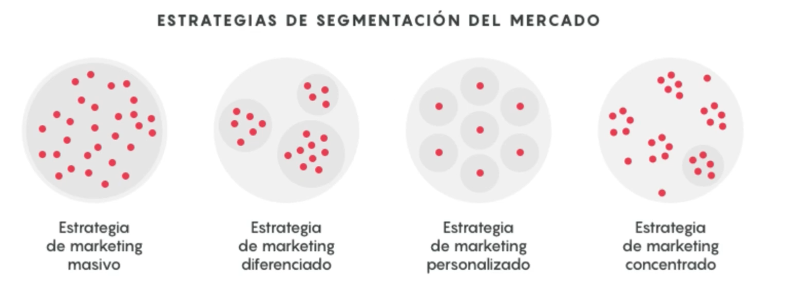
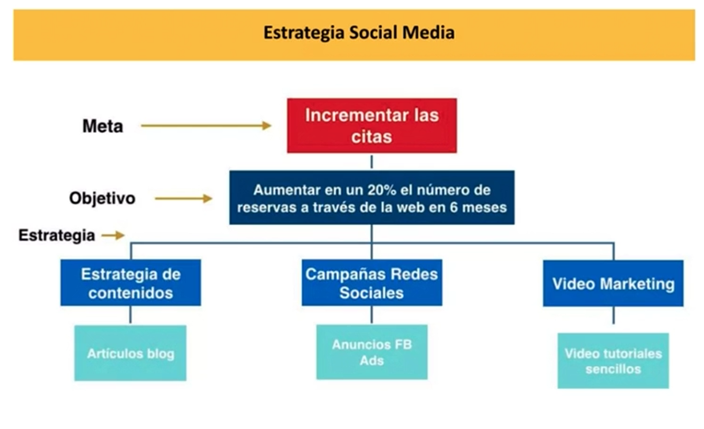
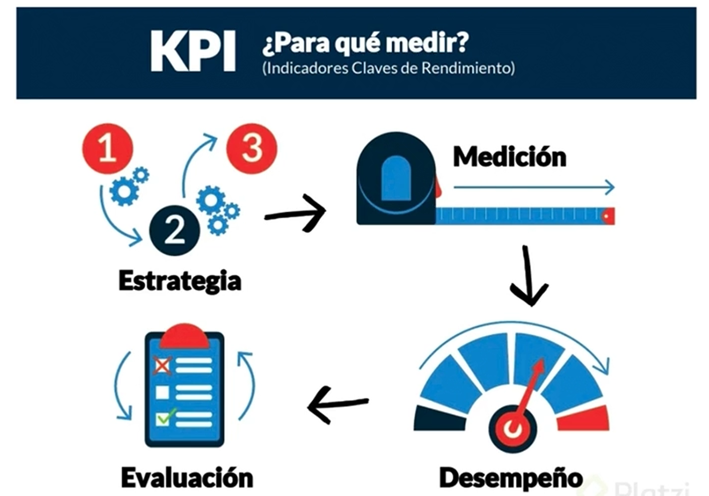
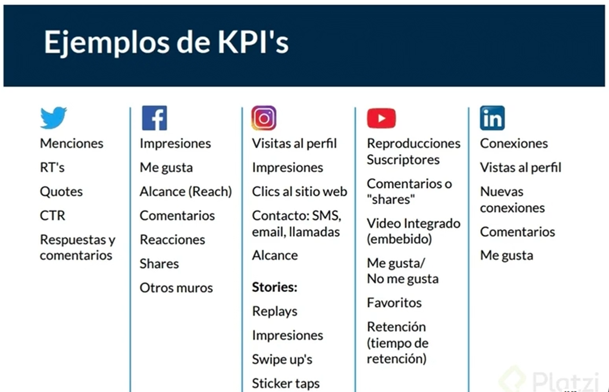
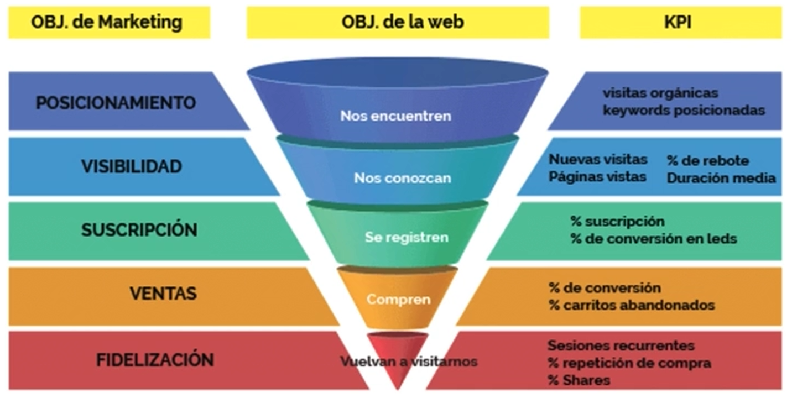

# 🟡 Introducción al Plan de Marketing

## ¿Qué es un plan de marketing y cómo se elabora?
Un plan de marketing es un documento estratégico que detalla las acciones que una empresa llevará a cabo para alcanzar objetivos de marketing específicos en un periodo determinado. Es una hoja de ruta que orienta cómo posicionar una marca, atraer clientes, aumentar ventas o fidelizar usuarios, entre otros fines.

## 🧩 Componentes claves: 
- **Análisis de la situación actual**: `FODA`, que implica entender el entorno interno como el externo de la empresa.

| Letra | Significado    | Tipo    | Descripción                                                                 |
|-------|----------------|---------|-----------------------------------------------------------------------------|
| **F** | Fortalezas     | Interno | Aspectos positivos propios que diferencian o favorecen (capacidades, recursos, reputación). |
| **O** | Oportunidades  | Externo | Factores externos que pueden beneficiar si se aprovechan (tendencias, nichos, tecnologías). |
| **D** | Debilidades    | Interno | Aspectos negativos propios que limitan o generan desventajas.              |
| **A** | Amenazas       | Externo | Factores externos que pueden afectar negativamente (crisis, competencia, cambios legales). |

- **Análisis de la competencia**: es crucial conocer a tus competidores, directos o indirectos.
    - **Herramientas** para el análisis: 
        - **semrush**: https://es.semrush.com/ → Marketing de contenido
        - **similarWeb**: https://www.similarweb.com/es/
        - **Trends**: https://trends.google.es/trends/ → permite conocer los temas que las personas están o no siguiendo, en tiempo real.

- **Análisis de TARGET - público objetivo**: segmentación de mercado

|                        | **Demográfica** | **Geográfica** | **Empresarial** | **Comportamiento** | **Psicográfica** |
|------------------------|-----------------|----------------|------------------|---------------------|------------------|
| **¿Qué tiene en cuenta?** | Atributos personales y profesionales | Características relacionadas con la localización o ubicación | Propiedades relacionadas con la compañía. Usada especialmente en B2B | El comportamiento frente a tu producto, servicio o empresa | Actitudes, valores, aspiraciones y otros criterios psicológicos |
| **Características más comunes** | Edad, género, educación, familia, ocupación, ingresos | País, región, idioma | Industria, tamaño de empresa, ubicación de la compañía, ingresos | Momento, frecuencia y nivel de uso, beneficios, etapa del comprador | Personalidad, estilo de vida, intereses, preocupaciones |
| **Ejemplo de segmento** | Hombre de 35 a 50 años, casado, con 2 hijos, de clase media, con cargo CTO (Chief Technical Officer) | Vive en Madrid y habla español e inglés | Trabaja en una empresa de entre 50 y 200 empleados del sector tecnológico | Ha visitado la página web de la empresa, se encuentra en la etapa de consideración | Es proactivo, tiene ganas de probar cosas nuevas, le encantan las tecnologías |
| **Nivel de dificultad** | Fácil | Fácil | Fácil | Medio | Avanzado |

- **KPI's y análisis de resultado**: 

`👉 Recuerda que un buen plan de marketing es una guía esencial para alcanzar tus objetivos de negocio.`

## ¿Cómo armar un Plan de Marketing utilizando Inteligencia Artificial?
La IA es una tecnología poderosa que puede ayudarnos a automatizar tareas, analizar datos y brindarnos información valiosa para tomar mejores decisiones. A continuación descubrirás cómo utilizar herramientas de Inteligencia Artificial para armar un plan de marketing efectivo que potencie el crecimiento de tu negocio. ¿Estás listo para descubrir el poder del marketing inteligente?

## Comprender nuestro mercado objetivo
- Comencemos por comprender nuestro mercado objetivo. La IA puede ayudarnos a recopilar y analizar datos relevantes sobre nuestro mercado objetivo, competencia y tendencias. Basarnos en información detallada sobre el comportamiento de nuestros clientes nos permite crear un Plan de Marketing más sólido hecho con datos reales y no solo suposiciones.
- Dos herramientas de IA útiles para hacer análisis de mercado son:
    - **IBM Watson Analytics**: Proporciona análisis avanzados, predictivos y visuales para comprender el comportamiento del mercado y las preferencias del cliente.
    - **Google Cloud Natural Language Processing**: Permite analizar y comprender grandes volúmenes de texto para extraer información valiosa sobre el mercado objetivo.

## Segmentación del mercado
La segmentación del mercado es crucial para dirigirnos a audiencias específicas. La IA puede ayudarnos a identificar segmentos de mercado más precisos mediante el análisis de grandes cantidades de datos demográficos, geográficos y de comportamiento. Esto nos permite personalizar nuestras estrategias de marketing y mensajes para llegar a cada segmento de manera más efectiva.

## Identificar tendencias y palabras clave
- Las herramientas de IA pueden rastrear conversaciones en redes sociales, analizar contenido en línea y extraer información relevante. Esto nos ayuda a descubrir los temas más hablados y a adaptar nuestras estrategias para maximizar el alcance y el impacto de nuestras campañas. Para la identificación de tendencias y palabras clave existen dos herramientas muy útiles:
    - **Google Trends**: Permite identificar las tendencias de búsqueda más populares y las palabras clave relevantes para tu industria.
    - **SEMrush**: Ofrece análisis de palabras clave, seguimiento de la competencia y datos de tendencias para ayudarte a optimizar tu estrategia de marketing.

## Creación de contenido personalizado
- Otro aspecto esencial de una campaña de marketing es la creación de contenido. Con IA podemos generar contenido personalizado para nuestros clientes a través de herramientas de generación de texto. Estas se basan en el análisis de datos demográficos, preferencias de compra y comportamiento del cliente en línea para producir contenido altamente relevante y atractivo para cada individuo. Para la generación de contenido podemos utilizar:
    - **Chat GPT**: Es una herramienta basada en inteligencia artificial que puede generar texto altamente personalizado según la información que le des.
    - **Persado**: Utiliza IA para generar mensajes de marketing persuasivos y personalizados para diferentes segmentos de audiencia.

## Distribución del contenido personalizado
- Una vez que hemos creado nuestro contenido personalizado, es hora de distribuirlo de manera inteligente. Las herramientas de IA nos permiten rastrear métricas clave como tasas de conversión y participación y realizar ajustes instantáneos para maximizar los resultados. Para la automatización de marketing y optimización de campañas podemos utilizar:
    - **HubSpot**: Ofrece una plataforma que te permite segmentar a tu audiencia, automatizar e-mails y realizar seguimiento de campañas.
    - **Optimizely**: Utiliza IA para realizar pruebas A/B automatizadas y optimizar continuamente tus campañas de marketing en función de los resultados en tiempo real.

## Seguimiento y medición de resultados
- Una vez hechos todos los pasos anteriores, el plan de marketing ya está listo para ponerlo en práctica. Algo fundamental para realizar seguimiento es medir resultados y realizar un análisis en pos de la mejora continua. Algunas herramientas de Inteligencia Artificial que te pueden ayudar para esto son:
    - **Google Analytics**: Proporciona análisis exhaustivos del rendimiento de tu sitio web, tráfico de búsqueda y conversiones, lo que te permite tomar decisiones basadas en datos para mejorar tus estrategias de marketing.
    - **Salesforce Einstein Analytics**: Ofrece análisis predictivos y de aprendizaje automático para ayudarte a comprender mejor el comportamiento del cliente y mejorar tus campañas de marketing.

👉 Estas son solo algunas de las herramientas disponibles en el mercado al día de hoy. A medida que la tecnología avanza, surgen nuevas herramientas de IA que pueden adaptarse a tus necesidades específicas de marketing. Por eso es importante conocerlas y actualizarse constantemente ya que el marketing es un campo muy activo en el que surgen muchas novedades.

Esperamos que tengas ganas de explorar todas las herramientas mencionadas para potenciar tus estrategias de marketing y armar planes y campañas de forma más fácil y sólida.