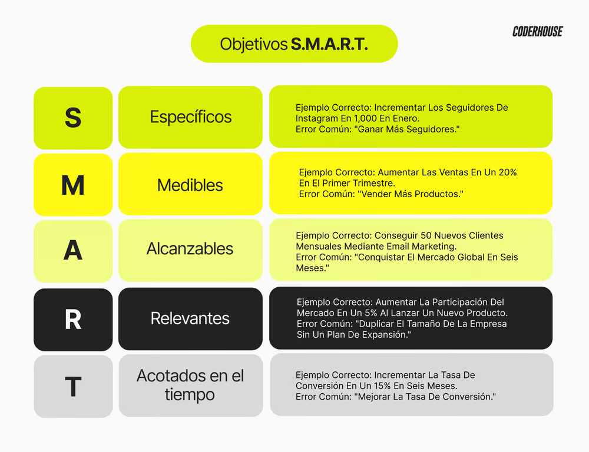

# 🟡 Definición de Objetivos con la Metodología S.M.A.R.T

Definir objetivos claros y alcanzables es fundamental para el éxito de cualquier estrategia de marketing. La metodología S.M.A.R.T. nos ayuda a establecer metas efectivas y a dirigir nuestros esfuerzos de manera eficiente. A continuación, explicamos cada uno de los componentes de esta metodología, con ejemplos prácticos y errores comunes a evitar.

## S - Específicos (Specific)
Los objetivos deben ser claros y precisos. Evita definiciones vagas que no indiquen un camino de acción claro.
- **Ejemplo**:
    - **Correcto**: "Incrementar los seguidores de Instagram en 1,000 en el mes de enero."
    - **Incorrecto**: "Ganar más seguidores."

## M - Medibles (Measurable)
Debemos poder medir nuestro progreso y éxito con indicadores claros.
- **Ejemplo**:
    - **Correcto**: "Aumentar las ventas en un 20% en el primer trimestre del año."
    - **Incorrecto**: "Vender más productos."

## A - Alcanzables (Achievable)
Los objetivos deben ser realistas y posibles de alcanzar, teniendo en cuenta los recursos disponibles.
- **Ejemplo**:
    - **Correcto**: "Conseguir 50 nuevos clientes mensuales mediante campañas de email marketing."
    - **Incorrecto**: "Conquistar el mercado global en seis meses."

## R - Relevantes (Realistic)
Los objetivos deben ser relevantes para las metas a largo plazo de la empresa.
- **Ejemplo**:
    - **Correcto**: "Aumentar la participación del mercado en un 5% al lanzar un nuevo producto en la línea premium."
    - **Incorrecto**: "Duplicar el tamaño de la empresa sin un plan de expansión."

## T - Acotados en el Tiempo (Time-related)
Es fundamental establecer un plazo concreto para alcanzar los objetivos.
- **Ejemplo**:
    - **Correcto**: "Incrementar la tasa de conversión en un 15% en los próximos seis meses."
    - **Incorrecto**: "Mejorar la tasa de conversión."

## Ejemplos Prácticos de Objetivos S.M.A.R.T.
- **Incrementar la Visibilidad en Redes Sociales**
    - **Específico**: Aumentar los seguidores de Instagram en 1,000.
    - **Medible**: Monitorizar el crecimiento semanalmente.
    - **Alcanzable**: Implementar una estrategia de contenido y campañas pagas.
    - **Relevante**: Mejorar la presencia online para atraer a más clientes.
    - **Temporal**: Lograr este aumento en un plazo de 3 meses.
- **Mejorar el Servicio al Cliente**
    - **Específico**: Reducir el tiempo de respuesta del servicio al cliente a menos de 24 horas.
    - **Medible**: Usar un sistema de seguimiento para medir los tiempos de respuesta.
    - **Alcanzable**: Contratar un nuevo agente de servicio al cliente.
    - **Relevante**: Incrementar la satisfacción del cliente.
    - **Temporal**: Alcanzar este objetivo en los próximos 6 meses.

## Errores Comunes a Evitar
- Ser Demasiado General
    - **Error**: "Aumentar las ventas."
    - **Solución**: Definir claramente cuánto y en qué plazo se quieren aumentar las ventas.
- Falta de Medición
    - **Error**: "Mejorar la satisfacción del cliente."
    - **Solución**: Establecer métricas específicas como "Incrementar la puntuación de satisfacción del cliente en un 10% en seis meses."
- Objetivos Inalcanzables
    - **Error**: "Ganar 10,000 seguidores en una semana sin invertir en publicidad."
    - **Solución**: Ajustar las expectativas a recursos y capacidades reales.
- No Especificar un Plazo
    - **Error**: "Incrementar la participación en el mercado."
    - **Solución**: "Incrementar la participación en el mercado en un 5% en el próximo año."

## ✔️ Conclusión
La metodología S.M.A.R.T. es una herramienta clave para definir objetivos de marketing claros, medibles y alcanzables. Al establecer metas específicas, medibles, alcanzables, relevantes y acotadas en el tiempo, las empresas pueden trazar un camino claro hacia el éxito y evaluar de manera efectiva su progreso.