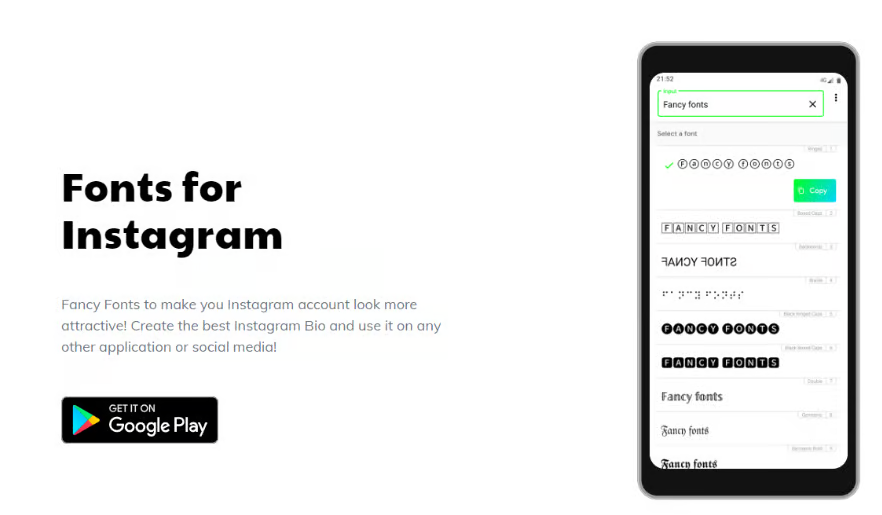
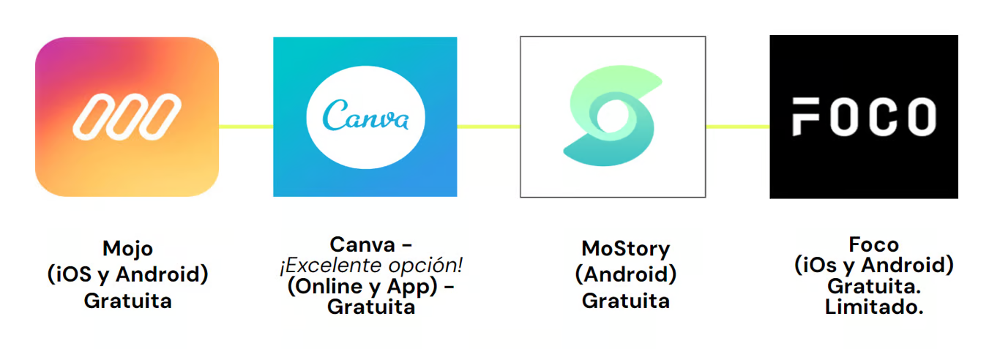

# 🟡 Recursos complementarios

## Formatos y herramientas de publicaciones

### Herramientas de edición de fotos
- **Remini**: Es una aplicación en línea para mejorar las fotos en tiempo real. Potenciada por la mejor tecnología de inteligencia artificial del mundo, Remini puede corregir fotos y videos de baja resolución, borrosos, pixelados, antiguos y dañados en un enfoque de alta calidad, nítido y claro.

- **Apps para teléfonos / tablets**:
    - Snapseed
    - EPIK
    - Snow
    - Lensa
    - Color Story
    - A Design Kit
    - Afterlight
    - Presco
    - Lightroom
    - Tezza

### Herramientas de edición de videos
- **Filmora X**: Usa este programa para darle a tu video el formato adecuado para subirlo a tus redes sociales. Aplica efectos increíbles a tu video y consigue resultados como un experto.
- **Filmora 9** : Usa este programa para darle a tu video el formato adecuado para subirlo a tus redes sociales. Aplica efectos increíbles a tu video y consigue resultados como un experto.
- **Inshot**: ¡Recomendado! Potente editor de vídeo y editor de fotos con funciones profesionales.

### Otras herramientas

Fuentes de lo más variadas para hacer más atractivo tu perfil en las redes de Facebook, Instagram, Whatsapp, Snapchat, etc.

Estas aplicaciones de edición de historias ofrecen plantillas personalizadas para crear diseños de collage de vídeo de alta calidad y compartir la historia directamente en Facebook, Instagram, Whatsapp, Snapchat, etc.

- **Adobe Color**: Muy util para captar inspiraciones de color a través de fotos. También para generar y guardar gamas cromáticas. Y por supuesto, elegir tu identidad visual.

## Diseño de contenido
- **Canva**: Crea y edita publicaciones para diferentes usos digitales o publicaciones. Ideal para aquellos que nunca diseñaron.
- **GIPHY**: Creador y banco de gifs y stickers. Muy útiles para publicaciones en Facebook, Instagram y/o Twitter

## Herramientas para programar contenido
- **Facebook Business Suite** (anterior creator studio): Crea, postea, agenda y administra el contenido y las interacciones de todas tus Fan Pages y cuentas en Instagram, todo desde un mismo lugar, y lo mejor es que es gratuita.

## Más herramientas útiles
- **Gramblr** (gratuita)
- **Buffer** (Periodo de prueba, paga)
- **Hootsuite** (Periodo de prueba, paga)
- **SocialGest** (paga)
- **Sked** (paga)

