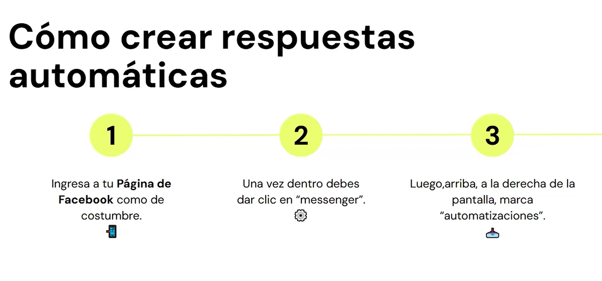
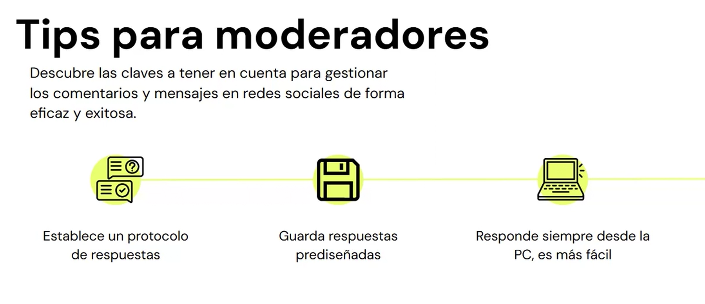

# 🟡Importancia de la Moderación
La moderación en redes sociales es una tarea esencial para cualquier empresa que utilice estas plataformas como parte de su estrategia de marketing. No solo se trata de gestionar comentarios y mensajes, sino de mantener una imagen de marca coherente y profesional, además de ofrecer una atención al cliente de calidad.

## ¿Por Qué Es Importante la Moderación?
- **Protección de la Imagen de Marca**: La forma en que una empresa maneja las interacciones en sus redes sociales refleja directamente su imagen pública. Comentarios negativos o spam pueden dañar la percepción de la marca si no se gestionan adecuadamente.
- **Mejora de la Atención al Cliente**: Las redes sociales se han convertido en un canal principal para la atención al cliente. Los clientes esperan respuestas rápidas y útiles a sus preguntas y problemas. Una moderación eficaz asegura que las consultas sean atendidas de manera oportuna, mejorando la satisfacción del cliente.
- **Fidelización del Cliente**: Responder a los comentarios y mensajes de manera efectiva puede aumentar la lealtad del cliente. Los clientes que sienten que sus opiniones son valoradas y que reciben atención personalizada tienen más probabilidades de ser fieles a la marca.
- **Prevención de Crisis de Comunicación**: Una respuesta inadecuada o la falta de respuesta puede escalar rápidamente y convertirse en una crisis de comunicación. La moderación permite gestionar las situaciones potencialmente conflictivas antes de que se conviertan en problemas mayores.

## Cómo Afecta la Moderación a la Imagen de la Marca
La moderación adecuada en las redes sociales puede mejorar significativamente la percepción de una marca. Aquí algunos aspectos clave:
- **Consistencia**: Mantener un tono y estilo consistentes en todas las respuestas refuerza la identidad de la marca.
- **Profesionalismo**: Responder de manera profesional, incluso a críticas negativas, muestra que la empresa se toma en serio a sus clientes y su propia reputación.
- **Transparencia**: Abordar los problemas abiertamente en lugar de eliminar comentarios negativos puede generar confianza en la audiencia.

## Estrategias de Moderación Efectiva
- **Establecer Directrices Claras**: Definir políticas sobre cómo responder a diferentes tipos de comentarios y mensajes ayuda a los moderadores a actuar de manera coherente.
- **Uso de Herramientas de Moderación**: Existen varias herramientas y plataformas que pueden ayudar a automatizar parte del trabajo de moderación, como filtrar spam o detectar comentarios inapropiados.
- **Formación del Equipo**: Los moderadores deben estar bien entrenados y familiarizados con los valores y la voz de la marca para manejar adecuadamente las interacciones.
- **Monitoreo Constante**: Mantener un ojo en las redes sociales de manera regular para responder rápidamente a cualquier problema o consulta.

## ✔️ Conclusión
En resumen, la moderación en redes sociales es crucial para lograr una imagen de marca positiva y ofrecer un servicio de atención al cliente de alta calidad. Implementar estrategias de moderación efectivas puede prevenir problemas, mejorar la satisfacción del cliente y fortalecer la lealtad hacia la marca.