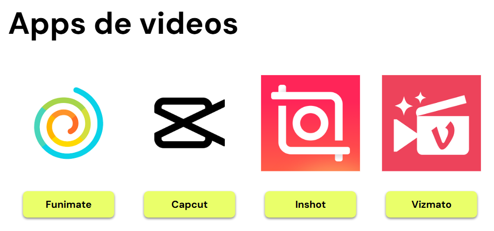

# 🟡 Tips finales y recomendaciones
Presentamos una serie de tips y recomendaciones finales que te ayudarán a maximizar el uso de las redes sociales en tu Plan de Marketing. Estos consejos están diseñados para reforzar la importancia de la constancia y la capacidad de adaptación a las tendencias, factores clave para el éxito en las plataformas sociales.

## Constancia en las Publicaciones
- **Calendario de Contenidos**: Desarrolla y sigue un calendario de contenidos. Esto te ayudará a mantener una frecuencia constante de publicaciones y asegurarte de que siempre haya contenido fresco y relevante en tus redes sociales.
- **Automatización**: Utiliza herramientas de programación de publicaciones para automatizar tus contenidos. Esto permite mantener la consistencia incluso cuando tienes otras tareas importantes que atender.
- **Evaluación Regular**: Revisa y ajusta tu calendario de contenidos regularmente basándote en el rendimiento y las estadísticas de tus publicaciones.

## Adaptación a las Tendencias
- **Monitoreo Activo**: Mantente al tanto de las tendencias actuales en las redes sociales. Utiliza herramientas de monitoreo de tendencias para identificar rápidamente qué está en auge y cómo puedes incorporarlo en tu estrategia.
- **Flexibilidad**: No tengas miedo de ajustar tu contenido en función de las tendencias emergentes. La flexibilidad es clave para mantenerse relevante.
- **Originalidad**: Aunque es importante seguir las tendencias, asegúrate de adaptar las ideas populares para que encajen con la identidad y el mensaje de tu marca.

## Interacción con la Audiencia
- **Responde Rápidamente**: La interacción oportuna con tus seguidores es crucial. Responde a los comentarios y mensajes lo más rápido posible para mostrar que valoras su participación.
- **Crea Encuestas y Preguntas**: Utiliza herramientas de interacción como encuestas y preguntas en tus publicaciones para fomentar el compromiso y obtener valiosos insights de tu audiencia.
- **Humaniza tu Marca**: Muestra el lado humano de tu marca. Comparte historias detrás de escenas, presenta a tu equipo y celebra hitos importantes con tu audiencia.

## Interacción con la Audiencia
- **Responde Rápidamente**: La interacción oportuna con tus seguidores es crucial. Responde a los comentarios y mensajes lo más rápido posible para mostrar que valoras su participación.
- **Crea Encuestas y Preguntas**: Utiliza herramientas de interacción como encuestas y preguntas en tus publicaciones para fomentar el compromiso y obtener valiosos insights de tu audiencia.
- **Humaniza tu Marca**: Muestra el lado humano de tu marca. Comparte historias detrás de escenas, presenta a tu equipo y celebra hitos importantes con tu audiencia.

## Uso de Herramientas Analíticas
- **Analiza Datos**: Utiliza las herramientas analíticas de cada plataforma para monitorear el rendimiento de tus publicaciones. Identifica qué tipos de contenido funcionan mejor y cuáles necesitan ajustes.
- **KPIs**: Define y sigue tus KPIs regularmente. Esto te ayudará a medir el éxito de tus estrategias y hacer ajustes basados en datos concretos.
- **Informes Periódicos**: Crea informes periódicos para revisar tu progreso. Estos informes te ayudarán a comunicar los resultados a tu equipo y ajustar las estrategias según sea necesario.

## Calidad sobre Cantidad
- **Contenido de Valor**: Enfócate en crear contenido de alta calidad que aporte valor a tu audiencia. Un contenido bien elaborado es más efectivo que múltiples publicaciones de menor calidad.
- **Diseño y Presentación**: Asegúrate de que tus publicaciones sean visualmente atractivas. Invierte en buenas herramientas de diseño o considera contratar a un diseñador si es necesario.
- **Relevancia**: Publica contenido relevante y útil para tu audiencia. Conocer a tu público objetivo y sus intereses te ayudará a crear contenido que realmente les importe.

## Integración Multicanal
- **Coherencia de Marca**: Mantén una voz y estética coherentes en todas tus redes sociales. Esto refuerza la identidad de tu marca y facilita el reconocimiento por parte de la audiencia.
- **Cross-Promoción**: Promociona tu contenido en diferentes plataformas. Por ejemplo, comparte tus videos de YouTube en Facebook e Instagram para aumentar el alcance.
- **Adaptación de Contenidos**: Adapta tus contenidos para que se ajusten a las características de cada plataforma. Lo que funciona en TikTok puede no ser tan efectivo en LinkedIn, por ejemplo.

👉 Finalmente, recuerda que el éxito en las redes sociales no ocurre de la noche a la mañana. Requiere tiempo, esfuerzo y dedicación. Mantente motivado, aprende de tus experiencias y no dudes en experimentar con nuevas ideas y estrategias.