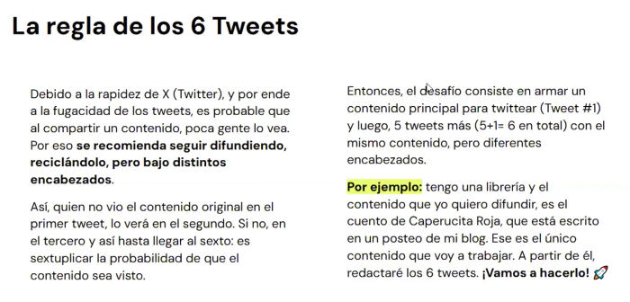
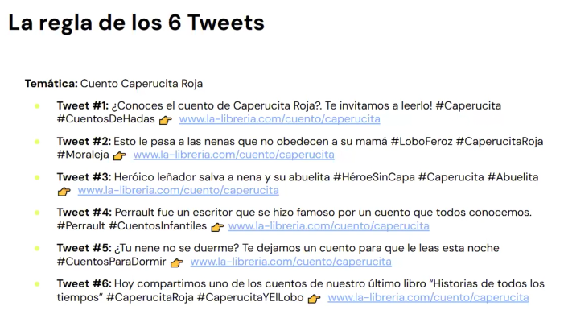

# 🟡 Recomendaciones para X (Twitter) y Anuncios

## Consejos prácticos para mejorar la presencia y efectividad en Twitter
- **Uso de Hashtags**
    - Recomendaciones:
        - **Incorpora hashtags relevantes**: Los hashtags son fundamentales para aumentar la visibilidad de tus tweets. Utiliza palabras clave que sean populares en tu industria.
        - **Limita la cantidad**: No utilices más de uno o dos hashtags por tweet para mantener la claridad del mensaje.
        - **Sigue tendencias**: Observa las tendencias diarias en la pestaña "Explorar" para identificar los temas populares y vincúlalos a tu marca de manera auténtica.
    - Ejemplos:
        - Si tienes una tienda de ropa, usa hashtags como #ModaSostenible o #Tendencias2024.
        - Durante eventos relevantes, como la Semana de la Moda, utiliza #FashionWeek para aumentar la participación.
- **Creación de Hilos**
    - Recomendaciones:
        - Contextualiza y expande: Los hilos te permiten conectar varios tweets para proporcionar más contexto, actualizaciones o ampliar opiniones.
        - Estructura clara: Asegúrate de que cada tweet en el hilo tenga sentido por sí mismo y se conecte lógicamente con el siguiente.
    - Ejemplos:
        - Crea un hilo para explicar un estudio de caso exitoso de tu empresa, dividiendo la información en partes manejables.
        - Usa hilos para narrar una historia de cliente o para detallar un evento paso a paso.
- **Uso de Contenido Visual**
    - Recomendaciones:
        - Incorpora imágenes y videos: Las imágenes y videos hacen que tus tweets sean más atractivos y aumentan el engagement.
        - Optimiza para la plataforma: Incluye el logo de tu empresa en los videos y subtítulos para que puedan ser entendidos sin sonido. Mantén los videos cortos, entre 6-15 segundos es ideal.
    - Ejemplos:
        - Publica imágenes de productos con descripciones breves y atractivas.
        - Comparte videos cortos de eventos, demostraciones de productos o testimonios de clientes.
- **Justificación**
    - **Hashtags**: Ayudan a ampliar el alcance de tus tweets y a participar en conversaciones relevantes, lo que puede atraer nuevos seguidores y aumentar la visibilidad de tu marca.
    - **Hilos**: Permiten compartir información detallada sin sobrecargar un solo tweet, facilitando una mejor comprensión y manteniendo a los seguidores interesados.
    - **Contenido Visual**: Las imágenes y videos son más atractivos y tienen una mayor probabilidad de ser compartidos, lo que incrementa el engagement y la visibilidad de tu contenido.

👉 Implementar estos consejos prácticos en tu estrategia de Twitter puede mejorar significativamente la presencia y efectividad de tu marca, ayudándote a alcanzar tus objetivos de marketing y construir una comunidad en línea sólida y activa.

## 📢 X (Twitter) Ads

**X Ads** (anteriormente *Twitter Ads*) es la plataforma publicitaria de la red social **X (antes Twitter)**. Permite a empresas, marcas o creadores promocionar productos, servicios o contenido mediante campañas publicitarias dirigidas a audiencias específicas.

### 🧰 ¿Qué ofrece X Ads?

#### 📌 Formatos de anuncios

- **Promoted Posts**: Tweets normales que se muestran a más personas.
- **Promoted Accounts**: Promociona tu cuenta para ganar seguidores.
- **Promoted Trends**: Destaca un hashtag o tema en la sección de tendencias (*opción premium*).
- **Image, Video y Carousel Ads**: Anuncios visuales e interactivos.
- **Website Click Ads**: Dirige tráfico hacia sitios web externos.
- **App Install Ads**: Promociona la instalación de aplicaciones móviles.

#### 🎯 Segmentación

Puedes segmentar a tu audiencia por:

- Ubicación
- Idioma
- Género
- Intereses
- Palabras clave
- Seguidores de cuentas específicas
- Dispositivo usado
- Comportamiento en la plataforma

#### 🎯 Objetivos de campaña

- Reconocimiento de marca
- Reproducciones de video
- Clics en enlaces o conversiones
- Seguidores
- Instalaciones de aplicaciones

#### 📊 Analítica

- Métricas en tiempo real: impresiones, clics, interacciones, CTR, CPC y más.
- Panel de control para gestionar campañas y presupuestos.

### 🚀 ¿Cómo comenzar?

1. Visita [ads.twitter.com](https://ads.twitter.com).
2. Inicia sesión con tu cuenta de X.
3. Selecciona el objetivo de la campaña.
4. Configura tu segmentación y presupuesto.
5. Crea el contenido del anuncio.
6. Lanza la campaña y monitorea resultados desde el panel.

### ✅ Ventajas

- Audiencia activa y enfocada en temas actuales.
- Segmentación precisa.
- Combinación efectiva entre alcance orgánico y pagado.
- Ideal para medios, aplicaciones, productos virales o servicios B2C.

### ❗ Consideraciones

- No tan visual como Instagram o TikTok Ads.
- Requiere una buena estrategia de segmentación y contenido.
- Puede no estar disponible en todos los países.