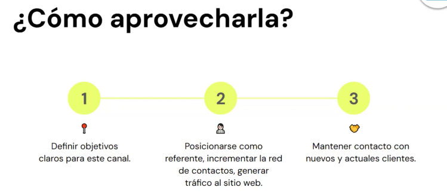

# 🟡 Estrategia de contenido y publicaciones en LinkedIn

## ¿Qué es LinkedIn?
LinkedIn es una red social orientada al uso empresarial, los negocios y el empleo. Ofrece grandes oportunidades para contactar y generar leads, y es esencial para posicionarse en el mundo profesional.

## Uso para Empresas
LinkedIn es fundamental para las empresas, ya que permite:
- Contactar con otros profesionales y empresas.
- Generar y nutrir leads.
- Construir y mantener relaciones con clientes actuales y potenciales.
- Posicionarse como un referente en su sector.

### Recomendaciones Específicas
- **Definir Objetivos Claros**: Establecer lo que se desea lograr con LinkedIn (p.ej., generar leads, aumentar la visibilidad de la marca).
- **Optimizar el Perfil de Empresa**: Asegurarse de que el perfil de la empresa esté completo y optimizado.
- **Publicar Contenido Regularmente**: Mantener una presencia activa con publicaciones relevantes y de valor.
- **Utilizar LinkedIn Ads**: Aprovechar las opciones de publicidad para llegar a un público más amplio y específico.
- **Interactuar con la Comunidad**: Responder a comentarios, participar en grupos y conectar con otros profesionales.



## Cómo Optimizar el Perfil de Empresa en LinkedIn

- Elementos Clave del Perfil
    - **Foto de perfil**: Logo.
    - **Foto de portada**: Que transmita la identidad de tu empresa.
    - **Color del perfil**: Acorde al manual de marca.
    - **Bio**: Invitación a que conecten con tu empresa a través de su sitio Web (Hashtags @ url).
    - **Tuit fijado**: Destacado Lo primero que ve quien entre a tu perfil.
- Descripción de la Compañía
    - **Visión y Misión**: Explicar claramente los objetivos y valores de la empresa.
    - **Productos y Servicios**: Describir brevemente los productos y servicios ofrecidos.
    - **SEO**: Incluir palabras clave relevantes para mejorar la visibilidad en las búsquedas.
- Ubicación y Contacto
    - **Ubicación**: Añadir la dirección de la empresa, pudiendo incluir varias ubicaciones.
    - **Botón Personalizado**: Incorporar un botón de acción (p.ej., "Visitar Sitio Web", "Contactarnos").
- Hashtags
    - **Uso de Hashtags**: Añadir hasta tres hashtags relevantes para facilitar la búsqueda del perfil de la empresa.
- Gestión de Idioma
    - **Multilingüismo**: Adaptar el perfil a diferentes idiomas si se tiene una audiencia global.

## Importancia del Marketing de Contenidos en LinkedIn

### ¿Por qué es Importante?
El marketing de contenidos en LinkedIn es esencial para:
- **Posicionarse como Líder de Opinión**: Publicar contenido relevante y de calidad posiciona a la empresa como un referente en su sector.
- **Aumentar la Visibilidad**: Contenido interesante y útil genera más visibilidad y alcance.
- **Fomentar el Engagement**: Interactuar con la audiencia a través de contenido valioso fortalece las relaciones y la comunidad alrededor de la marca.
- **Generar Leads**: Contenido bien orientado puede atraer potenciales clientes y oportunidades de negocio.

### Estrategias de Contenidos
- **Publicar Artículos y Post**: Crear y compartir artículos que aporten valor a la comunidad.
- **Videos y Multimedia**: Utilizar videos, infografías y otros recursos visuales para hacer el contenido más atractivo.
- **Participar en Grupos**: Involucrarse en grupos relevantes para compartir conocimientos y conectar con otros profesionales.
- **Webinars y Eventos**: Organizar y promocionar webinars y eventos a través de LinkedIn para aumentar la interacción y la visibilidad.
- **Actualizaciones Frecuente**s: Mantener el perfil activo con actualizaciones periódicas sobre novedades, logros y eventos de la empresa.

## ✔️ Conclusión
LinkedIn es una herramienta poderosa para empresas que buscan posicionarse en el mundo profesional. Optimizar el perfil, utilizar el marketing de contenidos y aprovechar LinkedIn Ads son estrategias clave para maximizar el impacto en esta red social. Con un enfoque claro y consistente, las empresas pueden construir una presencia sólida y efectiva en LinkedIn.

## 💼 Cómo Publicar en LinkedIn

**LinkedIn** es una red social profesional donde puedes compartir logros, reflexiones, contenido de valor y conectar con colegas, empresas y oportunidades laborales. Publicar contenido de forma estratégica puede ayudarte a aumentar tu visibilidad, autoridad y red de contactos.

### ✍️ Tipos de publicaciones que puedes hacer

- ✅ Actualizaciones profesionales (nuevo trabajo, proyectos, certificaciones)
- 🧠 Reflexiones o aprendizajes
- 📚 Recomendaciones de libros, artículos o recursos
- 🎯 Casos de éxito o métricas de proyectos
- 💬 Opiniones sobre tendencias en tu industria
- 📸 Imágenes o videos de eventos, charlas o equipos de trabajo
- 📢 Ofertas laborales o colaboraciones


### 🚀 ¿Cómo publicar paso a paso?

1. **Ingresa a [linkedin.com](https://www.linkedin.com)** e inicia sesión.
2. En la parte superior del feed, haz clic en **"Iniciar publicación"**.
3. Escribe tu contenido:
   - Usa un **gancho atractivo** en la primera línea.
   - Sé **claro y conciso** (puedes usar emojis, viñetas y espacios).
   - Agrega **hashtags relevantes** (3-5 máximo).
   - Puedes etiquetar personas o empresas con `@`.
4. Agrega una imagen, documento, enlace o video si aplica.
5. Haz clic en **"Publicar"**.

### 🧠 Buenas prácticas

- Publica con regularidad (1-3 veces por semana).
- Interactúa con los comentarios (responde, agradece).
- Sé auténtico: muestra tu experiencia, no solo lo "perfecto".
- Cuida la ortografía y la claridad.
- No abuses de los hashtags ni promociones.

### 📌 Ejemplo de estructura de publicación

```text
🚀 Logré completar mi primer proyecto en desarrollo web full stack con React y Node.js.

Ha sido un gran desafío, pero también una oportunidad increíble para aprender sobre integración de APIs, diseño responsivo y buenas prácticas de código.

🔧 Tech stack:
- React
- Node.js
- MongoDB

Gracias a [@nombre] por su mentoría 🙌

#DesarrolloWeb #ReactJS #NodeJS #FullStackDeveloper
```