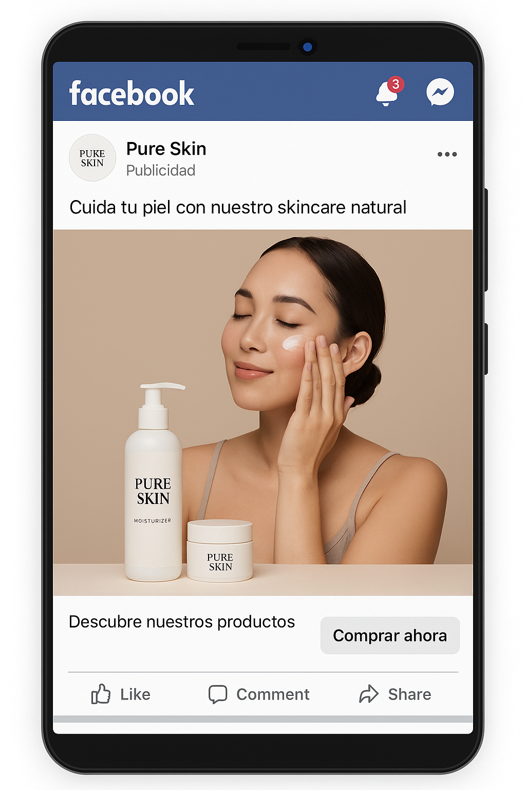

# 🟡 Actividad práctica. Modelos de anuncios para FB & IG

## Consigna
- Crear dos modelos de anuncios relacionados con las actividades que vienes trabajando esta unidad.
- Para la resolución de esta actividad puedes utilizar: Facebook Creative Hub o Admockups

## Sugerencias
- Tienes disponible una plantilla guía. Puedes hacer una copia de la misma y utilizarla.
- Una vez que lo tengas listo, puedes tomarle una captura y colocarlo en la copia de la plantilla.
- Fotos, vídeos, texto y/o botones (según sea el caso).

## 🧰 Recursos utilizados

- Herramienta: `Facebook Creative Hub` / `Admockups`
- Elementos incluidos:
  - ✅ Foto o video
  - ✅ Texto principal
  - ✅ Llamado a la acción (CTA)
  - ✅ Botón (si aplica)

---

## 📌 Modelo de Anuncio 1

**Objetivo del anuncio:** (ej. Aumentar el tráfico al sitio web)

**Descripción:**

- Público objetivo: Mujeres entre 25 y 40 años interesadas en productos de skincare natural.
- Formato: Imagen única
- CTA: "Comprar ahora"

**Captura del anuncio:**

---

## 📌 Modelo de Anuncio 2

**Objetivo del anuncio:** (ej. Generar registros a un formulario de contacto)

**Descripción:**

- Público objetivo: Emprendedores que buscan asesoramiento digital.
- Formato: Video corto (15 seg)
- CTA: "Más información"

**Captura del anuncio:**

