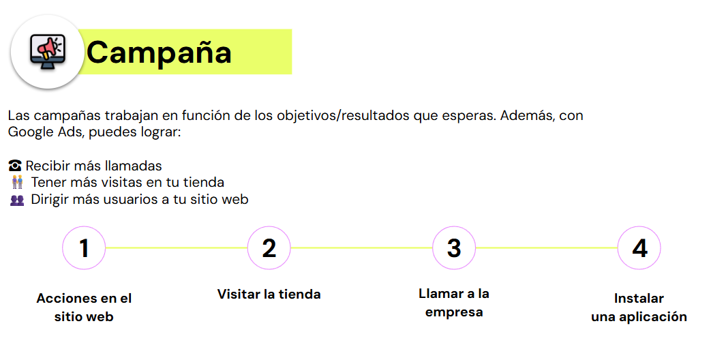
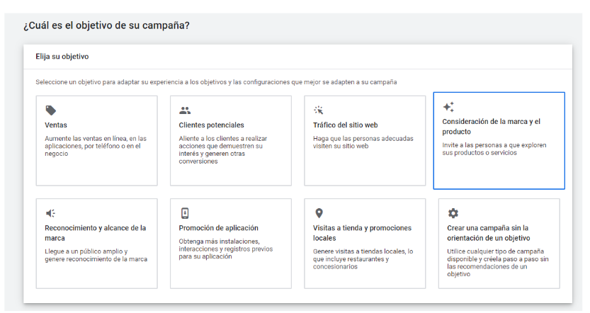
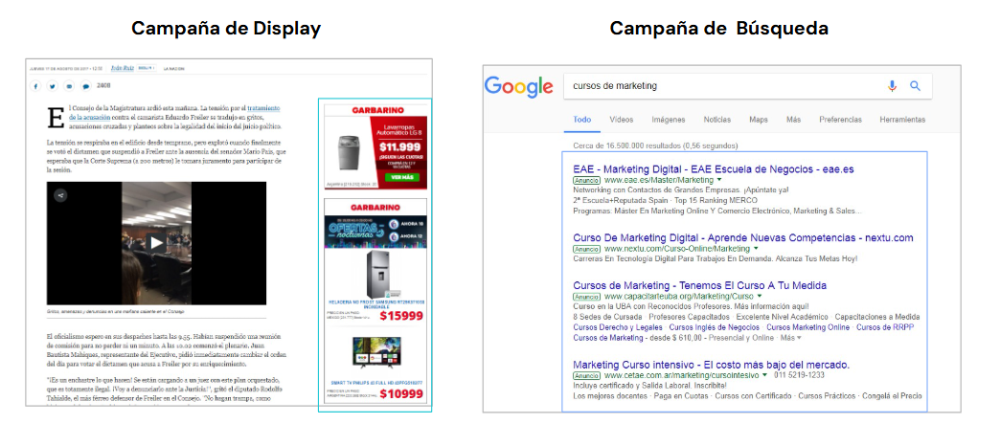
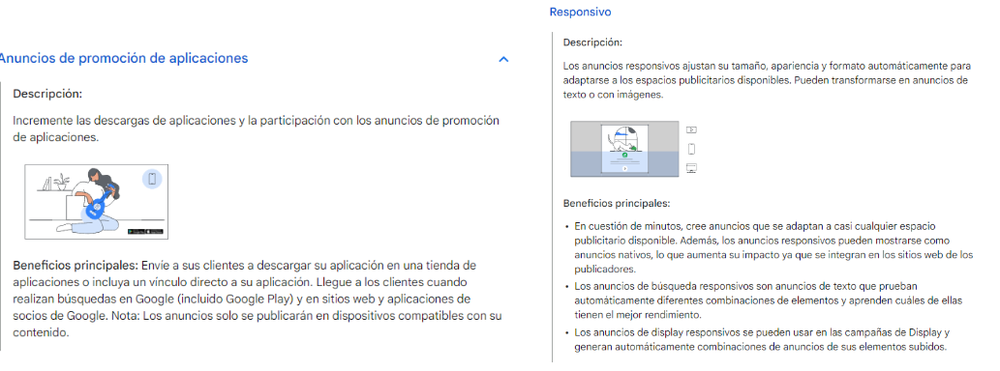
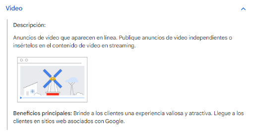
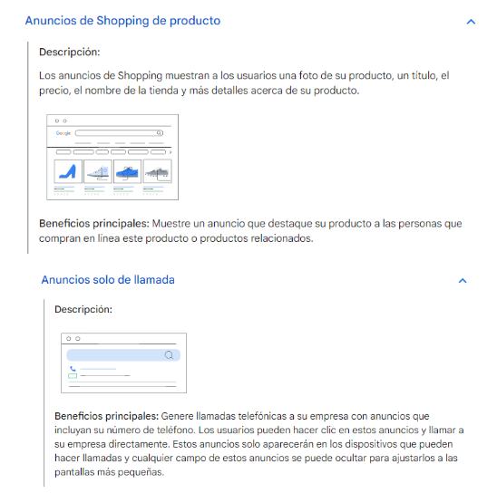

# 🟡 Estructura de campañas en Google Ads

## Tipos de campaña

## Formato de anuncios
Cada formato del anuncio tiene sus propios beneficios, ya sea la facilidad y el costo bajo de publicar anuncios de texto o las coloridas narraciones de los videos. Se puede publicar varios tipos de anuncios desde la misma cuenta de Google Ads y, en algunos casos, desde la misma campaña.

