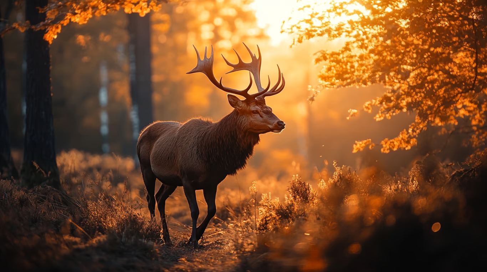
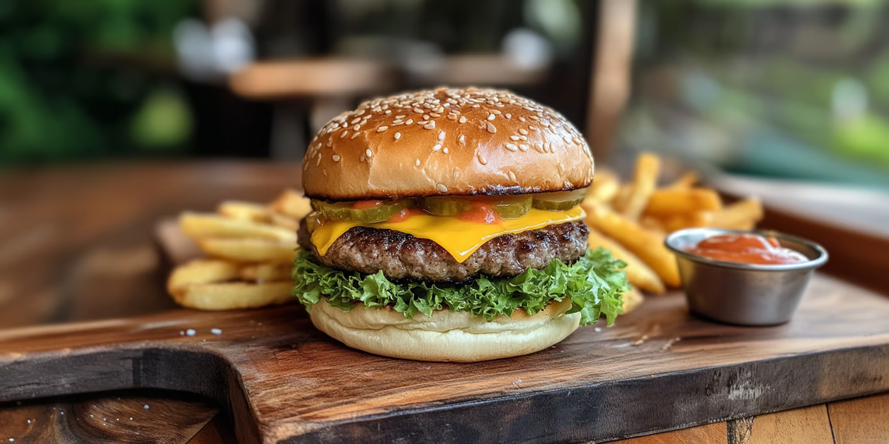

# 🟡 Midjourney
MidJourney es un generador de imágenes impulsado por IA que permite a los usuarios crear visuales a partir de texto. A través de descripciones detalladas (prompts), MidJourney utiliza algoritmos avanzados para interpretar el texto y producir imágenes de alta calidad que pueden ser utilizadas en diseño, marketing, publicidad o cualquier proyecto creativo. La herramienta se populariza en comunidades de diseño y redes sociales debido a su capacidad para crear imágenes artísticas y realistas en poco tiempo.

## ¿Cómo acceder a MidJourney?
- **Discord**: MidJourney opera principalmente en Discord. Los usuarios deben unirse al servidor oficial de MidJourney para interactuar con el bot que genera las imágenes.
- **Registro**: Es necesario crear una cuenta de Discord y unirse al canal de MidJourney. Los nuevos usuarios pueden utilizar un número limitado de créditos gratuitos antes de pasar a una **suscripción paga**.

## Funciones y Configuraciones Clave
- **Estilización (Stylizing)**
    - MidJourney permite ajustar el nivel de estilización o “artistic flair” de las imágenes mediante el parámetro –stylize. Cuanto más alto sea el valor de estilización, más interpretativa será la IA en relación con el prompt.
    - Ejemplo: En la imagen del ciervo caminando en el bosque, un valor alto de estilización agregaría más detalles artísticos a la luz del atardecer y los tonos cálidos del entorno.
    - Prompt: "Un ciervo caminando por un bosque al atardecer, iluminado por rayos dorados –stylize 800"
    
- **Modificaciones con Prompts**
    - MidJourney permite modificar imágenes generadas previamente mediante prompts ajustados, lo que permite mejorar detalles específicos.
    - En el caso de la hamburguesa con papas fritas, podríamos modificar la imagen para que se vea más "gourmet" o resaltar detalles como la textura del pan o la presentación.
    - Prompt: "Una hamburguesa gourmet con ingredientes frescos, pan dorado y papas fritas crujientes –stylize 500"
    
- **Describe (Función de Descripción)**
    - MidJourney ofrece la posibilidad de generar prompts a partir de una imagen existente. Esta función, llamada Describe, permite subir una imagen a la plataforma y la IA generará varios prompts sugeridos que se alinean con la imagen.
    - Ejemplo: Si subes la imagen del ciervo, la IA podría generar prompts como:
        - "Un ciervo caminando entre los árboles con luz dorada filtrándose a través del follaje"
        - "Un bosque místico iluminado por el sol al atardecer, con un ciervo en primer plano"
- **Variaciones (Vary)**
    - La herramienta permite generar variaciones de una imagen específica. Esto es útil para explorar diferentes enfoques visuales sin perder la esencia del prompt original.
    - En el caso de la hamburguesa, podrías generar variaciones para que el fondo cambie o para añadir ingredientes específicos a la comida, como salsas o nuevos elementos decorativos en el plato.

## Estructura de Prompts en MidJourney
La creación de imágenes efectivas con MidJourney depende en gran medida de la forma en que estructures tus prompts. Aquí te mostramos una estructura clara que puedes seguir para maximizar los resultados.
- **Descripción Detallada**:
    - Es importante proporcionar una descripción precisa para que la IA pueda entender qué elementos visuales incluir.
    - Ejemplo (ciervo): "Un majestuoso ciervo caminando entre árboles en un bosque otoñal, con luz dorada iluminando el paisaje al amanecer."
- **Contexto y Estilo**:
    - Especifica el contexto y el estilo artístico que deseas que la IA utilice.
    - Ejemplo (hamburguesa): "Una hamburguesa gourmet servida en un plato de madera con papas fritas doradas y crocantes, estilo fotografía culinaria, enfoque nítido."
- **Elementos Específicos**:
    - Asegúrate de mencionar elementos clave que no pueden faltar en la imagen.
    - Ejemplo (ciervo): "El ciervo debe tener cuernos grandes y curvados, con una atmósfera tranquila y pacífica, tonos cálidos y anaranjados predominantes."
- **Ajustes Técnicos** (Opcional):
    - Puedes ajustar parámetros como –stylize, –ar (aspect ratio), y otros para obtener la imagen perfecta.
    - Ejemplo (hamburguesa): "–ar 16:9 para una imagen más panorámica y –stylize 500 para un estilo fotográfico realista."

## Casos de Uso
- **Creación de Contenido para Redes Sociales**: MidJourney es ideal para generar imágenes únicas y llamativas para campañas de redes sociales. Las imágenes visualmente impactantes, como la del ciervo, podrían utilizarse en publicaciones de bienestar, naturaleza o conservación del medio ambiente.
- **Publicidad Gastronómica**: La capacidad de MidJourney para generar imágenes realistas hace que sea una excelente opción para promocionar alimentos. La imagen de la hamburguesa es un ejemplo claro de cómo un restaurante podría utilizar la herramienta para crear fotos atractivas para sus menús digitales o publicaciones en redes.
- **Diseño de Anuncios y Publicidad**: MidJourney puede ayudar a los diseñadores gráficos a crear material publicitario rápido y efectivo para distintas plataformas, sin necesidad de fotos profesionales. La versatilidad de los prompts permite generar múltiples variaciones de una misma idea visual, adaptándola a diferentes estilos o audiencias.